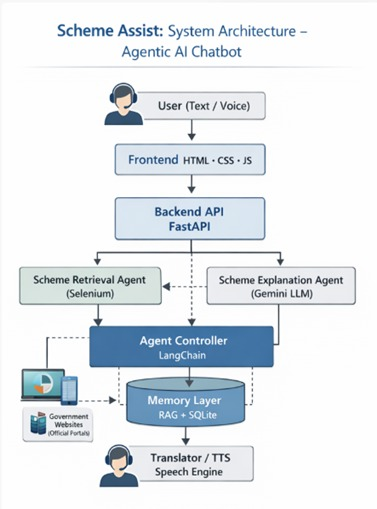
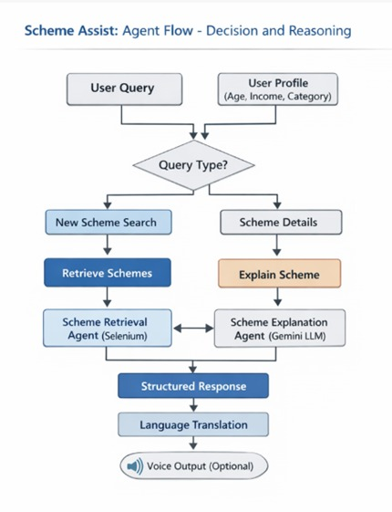

# 🏛️ Scheme Assist  
### Agentic AI–Based Government Scheme Guidance System

Scheme Assist is an **agentic AI-powered chatbot** designed to help users discover, understand, and explore **government schemes** they are eligible for.  
The system uses **FastAPI**, **LangChain**, **Gemini LLM**, **RAG**, and **automation tools** to provide accurate, personalized, and easy-to-understand responses.

---

## ✨ Key Features

- 🤖 Agentic AI architecture (decision + reasoning)
- 🔐 Secure authentication using JWT
- 🔍 Real-time scheme retrieval from official portals
- 🧠 LLM-based scheme explanation in simple language
- 💾 Memory layer using RAG + SQLite
- 🌐 Optional translation support
- 🔊 Optional voice output (TTS)

---

## 🧠 System Architecture



**Figure 1** illustrates the overall system architecture of Scheme Assist, showing the interaction between the user, frontend, backend services, AI agents, external government portals, and the memory layer.

---

## 🔄 Agent Flow – Decision & Reasoning



**Figure 2** illustrates the interaction and decision-making process between agents.  
The system dynamically decides whether to search for **new schemes** or **explain existing schemes**, ensuring accurate and context-aware responses.

---

## 📂 Project Structure
```
FINAL PROJECT/
│
├── backend/
│ ├── tools/
│ │ ├── generate_scheme_info.py
│ │ └── search_for_schemes.py
│ │
│ ├── utils/
│ │ ├── gemini.py
│ │ ├── scheme_search.py
│ │ └── schemes.py
│ │
│ ├── agent.py # Agent orchestration (LangChain)
│ ├── auth.py # Authentication logic
│ ├── database.py # Database connection
│ ├── dependencies.py # FastAPI dependencies
│ ├── main.py # FastAPI entry point
│ ├── models.py # Database models
│ ├── schemas.py # Pydantic schemas
│ └── security.py # JWT & security utilities
│
├── frontend/
│ ├── chat.html # Chatbot UI
│ └── login.html # Login UI
│
├── .env # Environment variables
├── db.py # Database helper
├── users.db # SQLite database
└── requirements.txt # Project dependencies
```

---

## 🛠️ Technologies Used

### Backend
- Python 3.11
- FastAPI
- LangChain
- Google Gemini LLM
- JWT Authentication

### Frontend
- HTML
- CSS
- JavaScript

### Database
- SQLite

### AI & NLP
- LangChain Agents
- Retrieval-Augmented Generation (RAG)
- Google Generative AI (Gemini)

### Automation & Utilities
- Selenium
- WebDriver Manager

### Speech & Language
- SpeechRecognition
- pyttsx3
- Translation & Language Detection

---

## 📦 Required Libraries

Install all required dependencies using:

```bash
pip install -r requirements.txt
```
## 🚀 Installation & Setup

1️⃣ Clone the Repository
```
git clone https://github.com/Revanth1310/scheme-assist.git
cd scheme-assist
```

2️⃣ Create Virtual Environment (Recommended)
```
python -m venv venv
```

Activate the environment:

- Windows
```
venv\Scripts\activate
```
- Linux / macOS
```
source venv/bin/activate
```
3️⃣ Install Dependencies
pip install -r requirements.txt

## 🔊 FFmpeg Setup (Required for Voice & Whisper)

⚠️ FFmpeg is an external dependency and must be installed manually.

✅ Step 1: Download FFmpeg

- Go to the official trusted site:

👉 https://www.gyan.dev/ffmpeg/builds/

- Download:

ffmpeg-git-full.7z (recommended)

or

ffmpeg-git-full.zip


✅ Step 2: Extract

After extraction, ensure this structure exists:
```
ffmpeg-git-full/
 ├── bin/
 │    ├── ffmpeg.exe
 │    ├── ffprobe.exe
 │    └── ffplay.exe
```
✅ Step 3: Move & Rename

- Rename the folder:

ffmpeg-git-full → ffmpeg


- Move it to:
```
C:\ffmpeg
```
- Final path should be:
```
C:\ffmpeg\bin\ffmpeg.exe
```
✅ Step 4: Add FFmpeg to PATH

- Press Win + S → search Environment Variables
- Open Edit the system environment variables
- Click Environment Variables
- Under System variables, select Path
- Click Edit → New
- Paste:
```
C:\ffmpeg\bin
```

Click OK and restart Command Prompt

✅ Step 5: Verify FFmpeg Installation

Open a new terminal and run:
```
ffmpeg -version
```

✔️ If version details appear, FFmpeg is correctly installed

✔️ Whisper and voice features will now work

## ▶️ Running the Application
```
cd backend
uvicorn main:app --reload
```
# Open the frontend files in your browser:
```
frontend/login.html

frontend/chat.html
```
## 🔮 Future Enhancements

🌐 Regional language support

🎙️ Voice-only interaction

📱 Mobile application

🧾 Scheme application tracking

🔐 Aadhaar-based verification

# 👨‍💻 Author

Chandika Purna Revanth

B.Tech – AI & ML